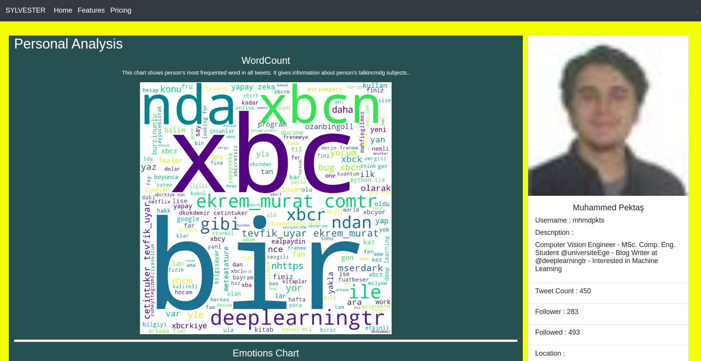

# Sylvester

Tweetter profile analizer app.


## Usage

1. Edit following code with your token and keys

consumer_key = "xxxxxxx"
consumer_secret = "xxxxxxx"
access_token = "xxxxxxx"
access_token_secret = "xxxxxxx"

2. İf you run app first time, please uncomment following codes.

\# nlp.download('punkt') \
\# nlp.download('stopwords') \
\# nlp.download('wordnet') \
\# nlp.download('vader_lexicon')


3. Run following code

``` $python app.py ```

## Screenshots




